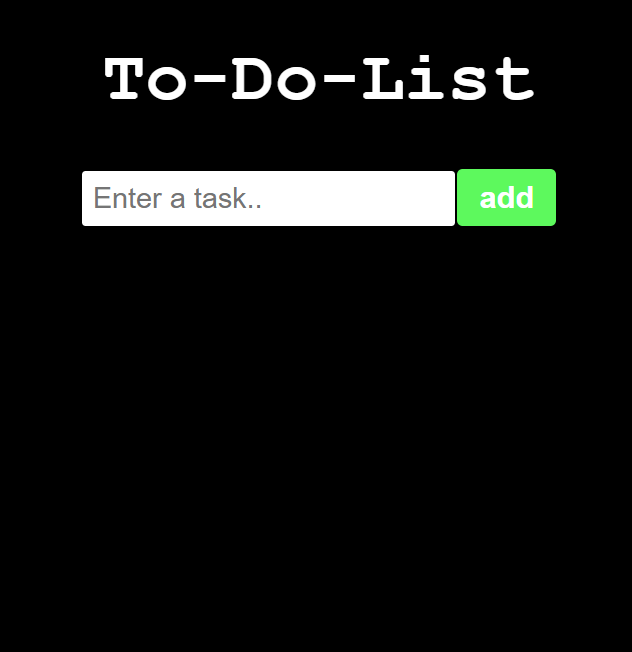
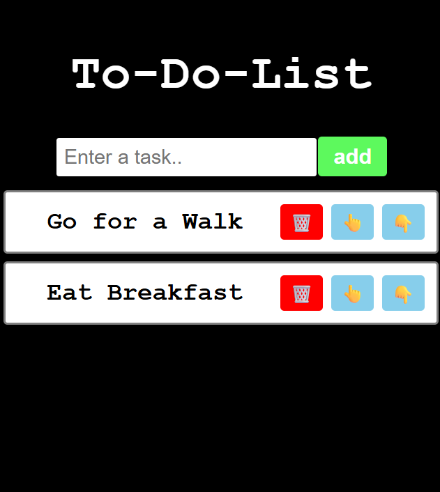
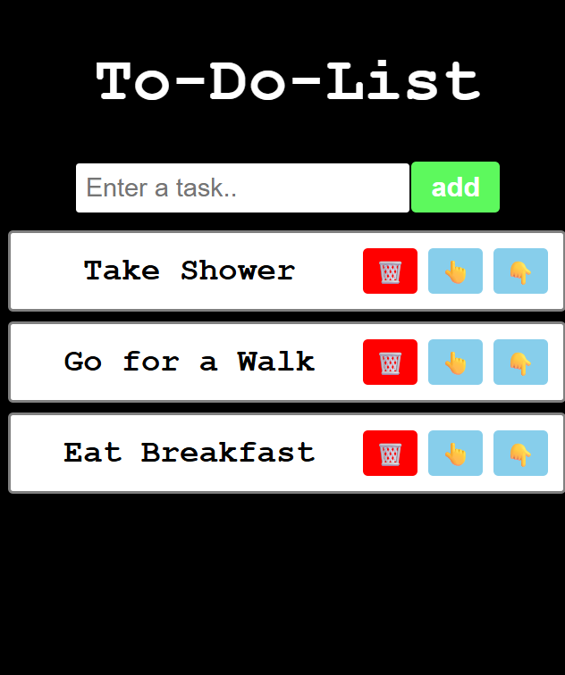
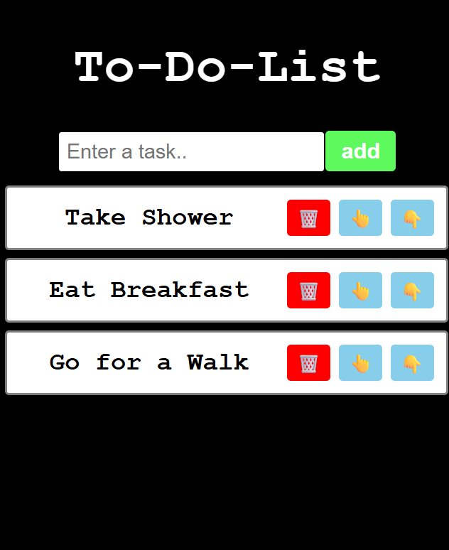
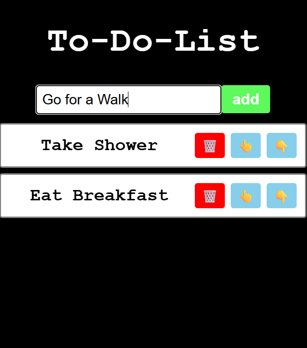
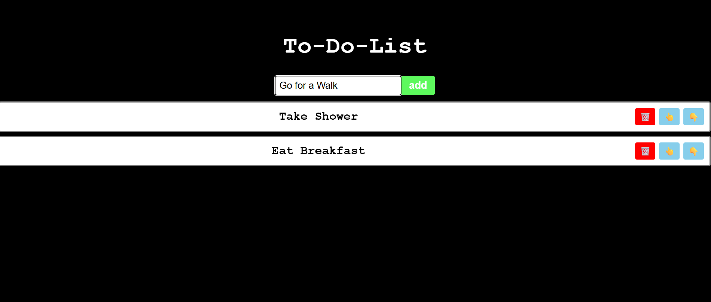

# 📝 To-Do-List App [Sequencingg Feature]

A React-based To-Do List application with manual sequence reordering using React Hooks.

---
## 🖼️ Screenshots
 
| 🗒️ ToDoList using React Hook 1 | 🗒️ ToDoList using React Hook 2 (ADD) |
|:---:|:---:|
|  |  |
 
| 🗒️ ToDoList using React Hook 3 (ADD) | 🗒️ ToDoList using React Hook 4 (Sequence Change to Up) |
|:---:|:---:|
|  |  |
 
| 🗒️ ToDoList using React Hook (DELETE) | 🗒️ ToDoList using React Hook (Full Screen) |
|:---:|:---:|
|  |  |
 

---

## 🚀 Features

- ✅ Add new tasks via input field
- 🗑️ Delete tasks with the red trash button
- 👆👇 Manually reorder tasks up or down
- 🔁 State managed entirely with React Hooks (`useState`)
- ⚫ Black background with white task cards

---

## 🛠️ Tech Stack

| Technology | Version | Purpose |
|:---:|:---:|:---|
| ⚛️ **React** | 18+ | UI library & functional components |
| 🪝 **React Hooks** | `useState` | State management (todos, input) |
| ⚡ **Vite** | 5+ | Fast dev server & build tool |
| 📦 **npm** | 9+ | Package manager |
| 🎨 **CSS** | styles | Layout, theming & black UI |
| 🌐 **HTML5** | — | App entry point (`index.html`) |
| 🟨 **JavaScript** | ES6+ | Core logic & array manipulation |

---

## 📦 Getting Started

```bash
# Clone the repo
git clone https://github.com/your-username/todo-list.git

# Navigate into the project
cd todo-list

# Install dependencies
npm install

# Start the development server
npm run dev
```

///////////////////////////////////////////////////////////////////////////////////

# React + Vite

This template provides a minimal setup to get React working in Vite with HMR and some ESLint rules.

Currently, two official plugins are available:

- [@vitejs/plugin-react](https://github.com/vitejs/vite-plugin-react/blob/main/packages/plugin-react) uses [Oxc](https://oxc.rs)
- [@vitejs/plugin-react-swc](https://github.com/vitejs/vite-plugin-react/blob/main/packages/plugin-react-swc) uses [SWC](https://swc.rs/)

## React Compiler

The React Compiler is not enabled on this template because of its impact on dev & build performances. To add it, see [this documentation](https://react.dev/learn/react-compiler/installation).

## Expanding the ESLint configuration

If you are developing a production application, we recommend using TypeScript with type-aware lint rules enabled. Check out the [TS template](https://github.com/vitejs/vite/tree/main/packages/create-vite/template-react-ts) for information on how to integrate TypeScript and [`typescript-eslint`](https://typescript-eslint.io) in your project.
